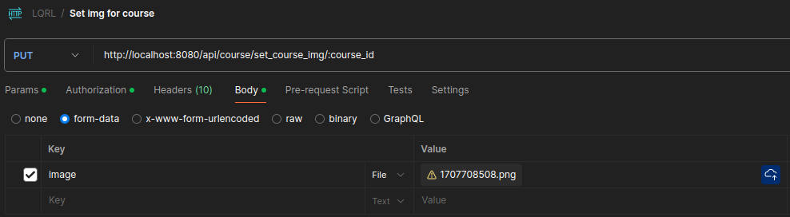

# lqrl-back

## Examples
### api/course/get_courses

Optional request parameters - filters, list_options

All fields are optional

- Return courses whose price is from 40 to 70 OR the color is indigo
    
    ``` filters: [{"price": {"$gte": 40, "$lte": 70}}, {"color": {"$eq": "indigo"}}] ```

- Skip 2 courses, return 5, sort in descending order by price field
   
    ``` list_options: {"limit": 5, "offset": 2, "order_bys": "!price"} ```

documentation: https://lib.rs/crates/modql


### /api/course/set_course_img/:course_id

Params: 

- course_id - path parameter
- form_data, Key = "image", type = file 

